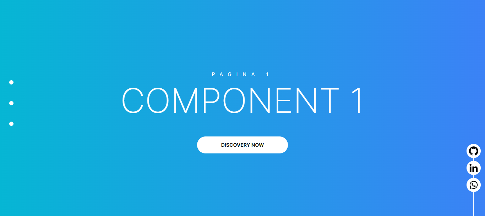

# Auto Scrolling 

Este projeto é um site de demonstração com foco em transições automáticas entre seções, utilizando React, Next.js, Tailwind CSS, Framer Motion e outras tecnologias para criar animações suaves e responsivas.

## Tecnologias Utilizadas

- **Next.js**: Framework React para desenvolvimento full-stack com rotas otimizadas e recursos de renderização híbrida.
- **Framer Motion**: Biblioteca de animações para React, usada para criar transições suaves e interativas.
- **Tailwind CSS**: Framework CSS utilitário para estilização rápida e eficiente.
  
## Funcionalidades

- Rolagem automática entre seções a cada 10 segundos, com opção de rolagem manual.
- Botões de navegação com animações de entrada.
- Integração com componentes React personalizados.

## Estrutura de Diretórios

```plaintext
src/
├── app/
│   ├── favicon.ico           # Ícone do site
│   ├── globals.css           # Estilos globais
│   ├── layout.tsx            # Layout principal do site
│   └── page.tsx              # Página principal com transições automáticas
├── assets/
│   └── Apex_1695943288919.png # Imagem utilizada no projeto
├── components/
│   ├── HomeSection.tsx       # Componente das seções da página
│   └── RedesSociais.tsx      # Componente para ícones das redes sociais
```

#Instalação

Requisitos
Node.js (versão 14 ou superior)
npm ou yarn
Passos para Instalar
Clone o repositório:
bash
Copiar código
git clone https://github.com/Josefs-stack/ScrollingPage.git
cd ScrollingPage
Instale as dependências:
bash
Copiar código
# Usando npm
npm install

### Dependências
- [framer-motion](https://www.framer.com/motion/)
- [@rocketseat/eslint](https://github.com/Rocketseat/eslint-config-rocketseat)


